# Flujo de Implementación de Autenticación con Keycloak

Este documento describe el proceso seguido para configurar la autenticación, el MFA y la protección de una API utilizando Keycloak.

## 1. Configuración del Servidor y Realm
Se inició el servidor de Keycloak utilizando Docker Compose y se creó el Realm **LaboratorioDev.** (nótese el punto al final).

*   **Creación del Realm:** 
    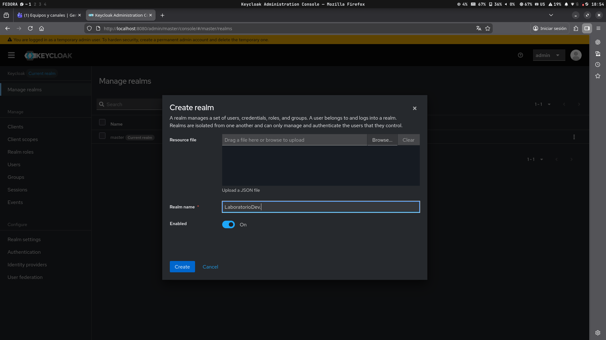
*   **Vista del Panel:**
    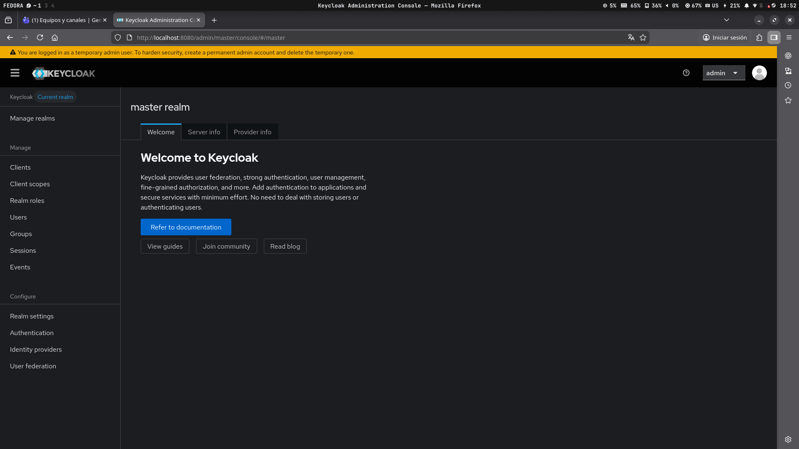

## 2. Gestión de Clientes y Usuarios
Se configuró el cliente para el backend y se creó un usuario de prueba.

*   **Configuración del Cliente:**
    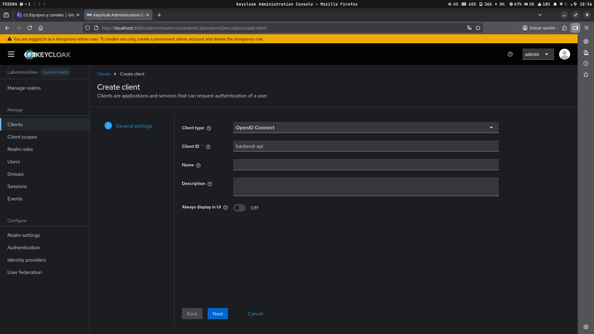
    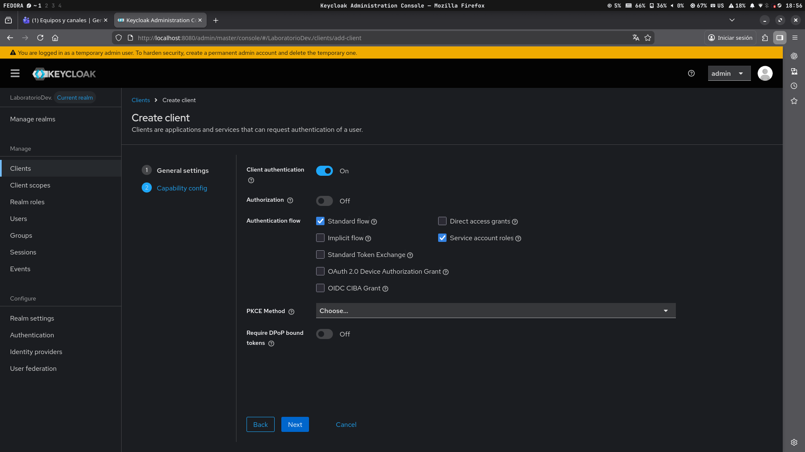
*   **Activación de Direct Access Grants:**
    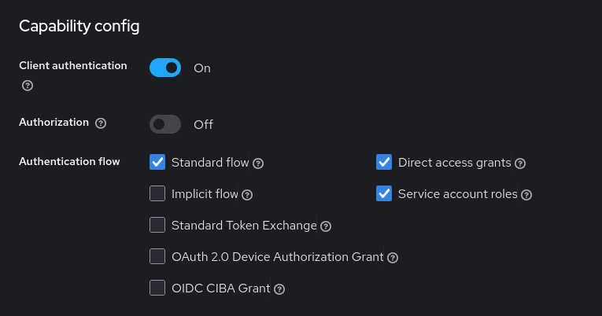
*   **Creación del Usuario:**
    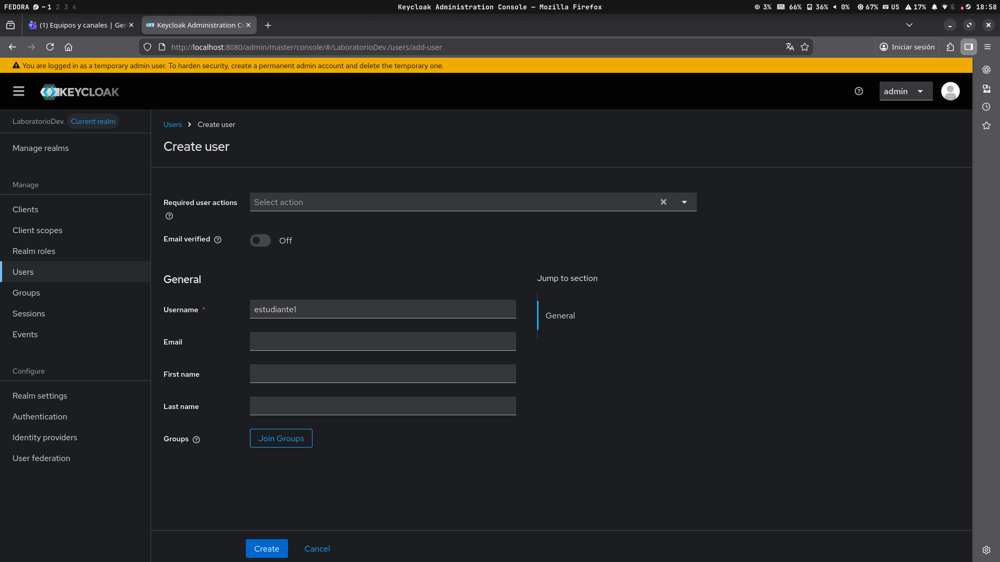
*   **Configuración de Contraseña:**
    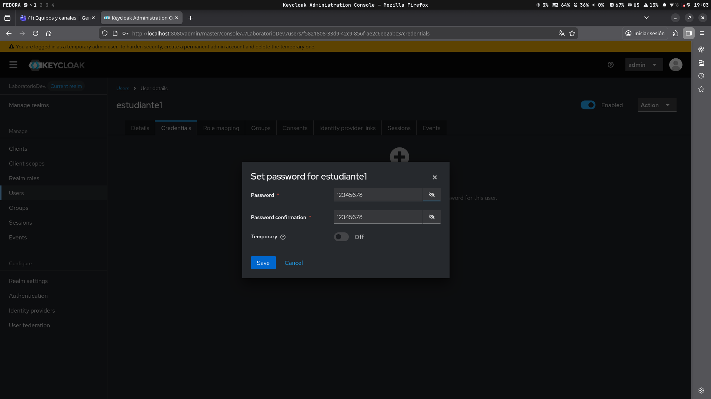

## 3. Implementación de MFA (Multi-Factor Authentication)
Se obligó al usuario a utilizar un segundo factor de autenticación.

*   **Configuración del Flujo Browser:**
    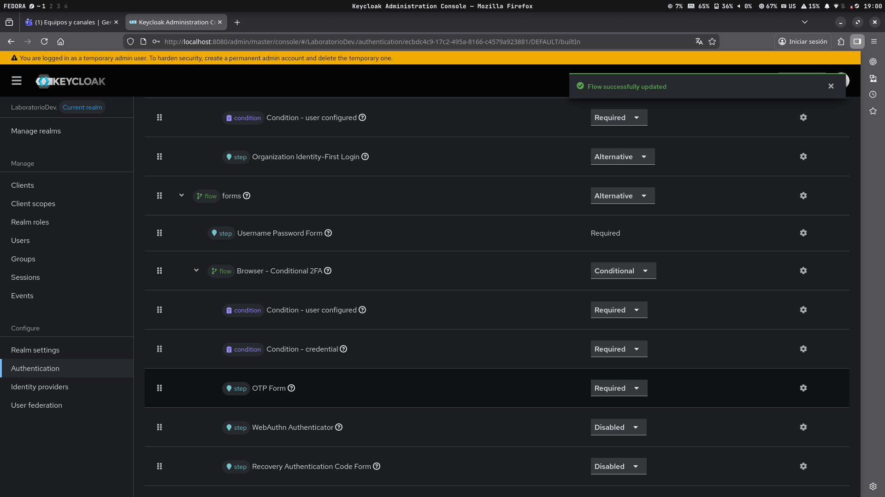
*   **Requerimiento de OTP:**
    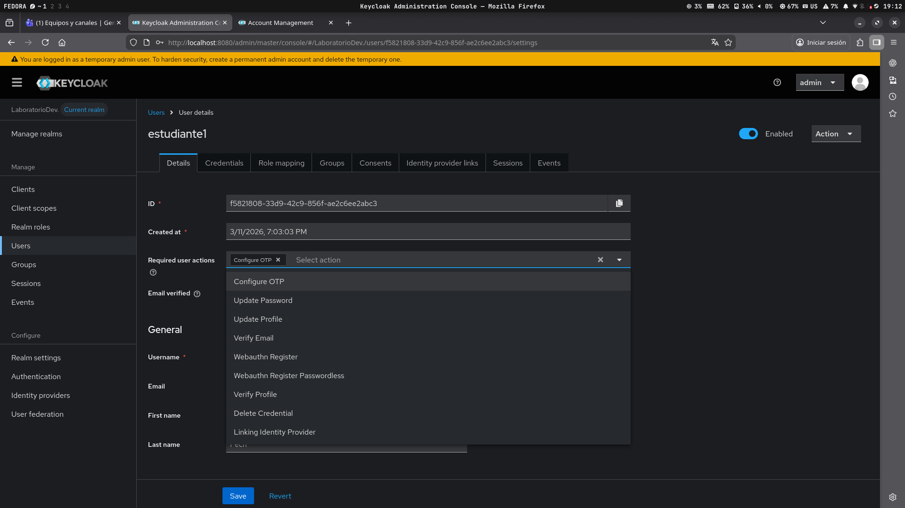
*   **Formulario de Perfil:**
    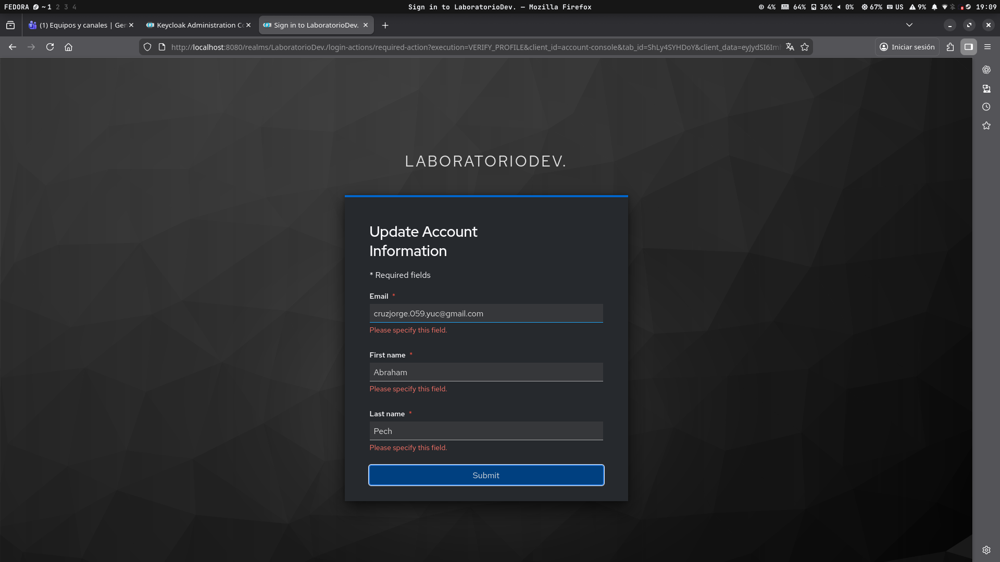
*   **Configuración de QR:**
    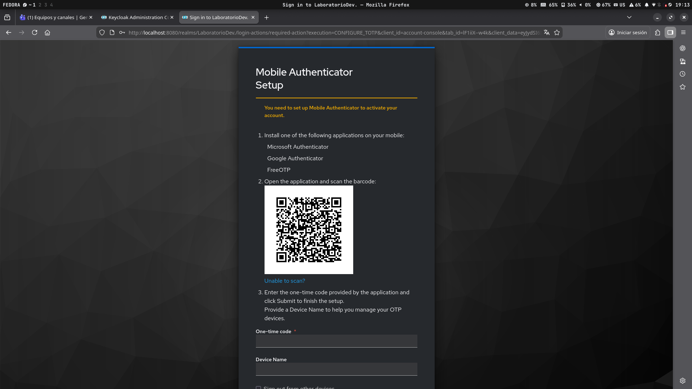
*   **Verificación de Código:**
    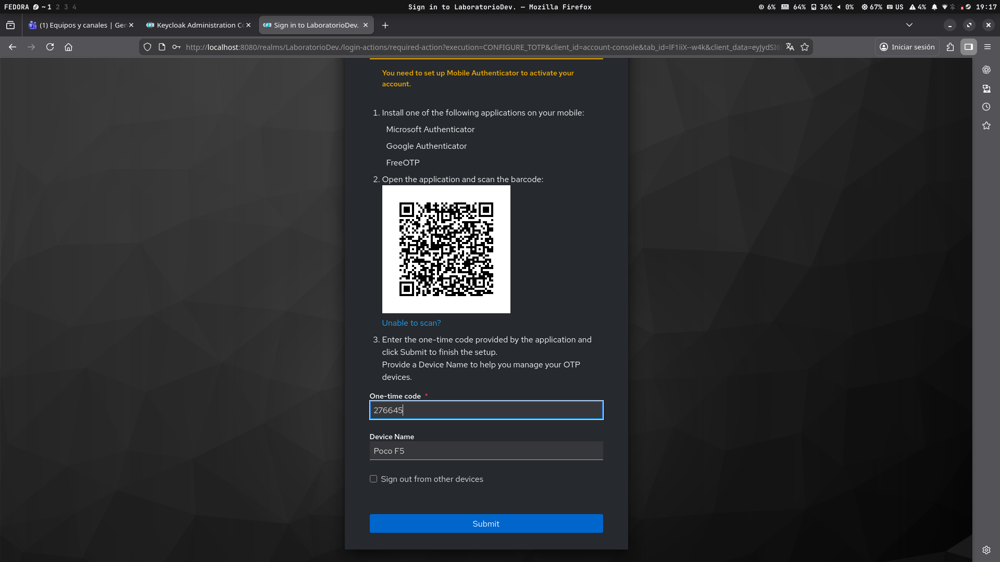

## 4. Validación en el Backend y Pruebas con Postman
Se verificó que la API protegida solo permitiera el acceso con un token válido emitido por Keycloak.

*   **Consola de Usuario exitosa:**
    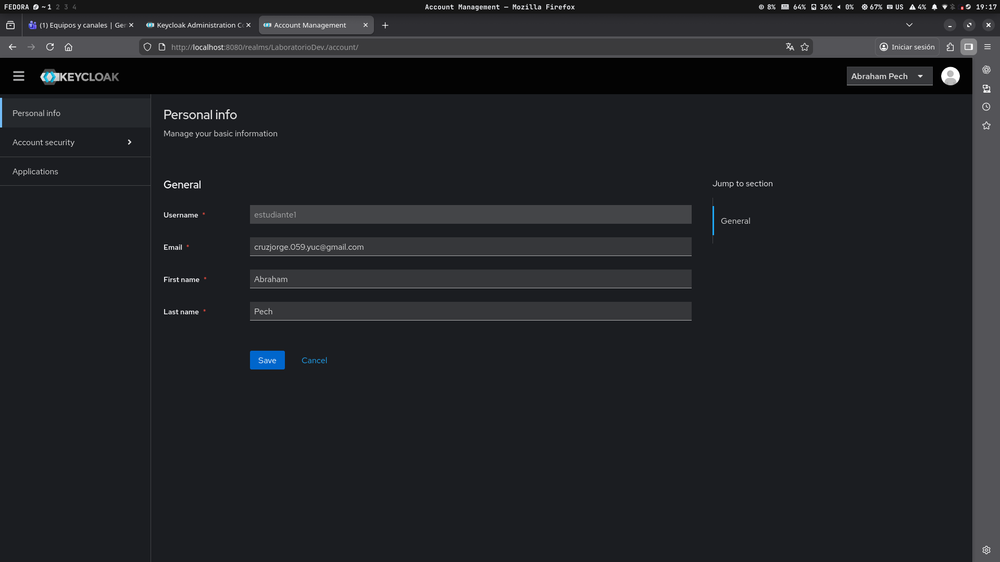
*   **Obtención de Token en Postman:**
    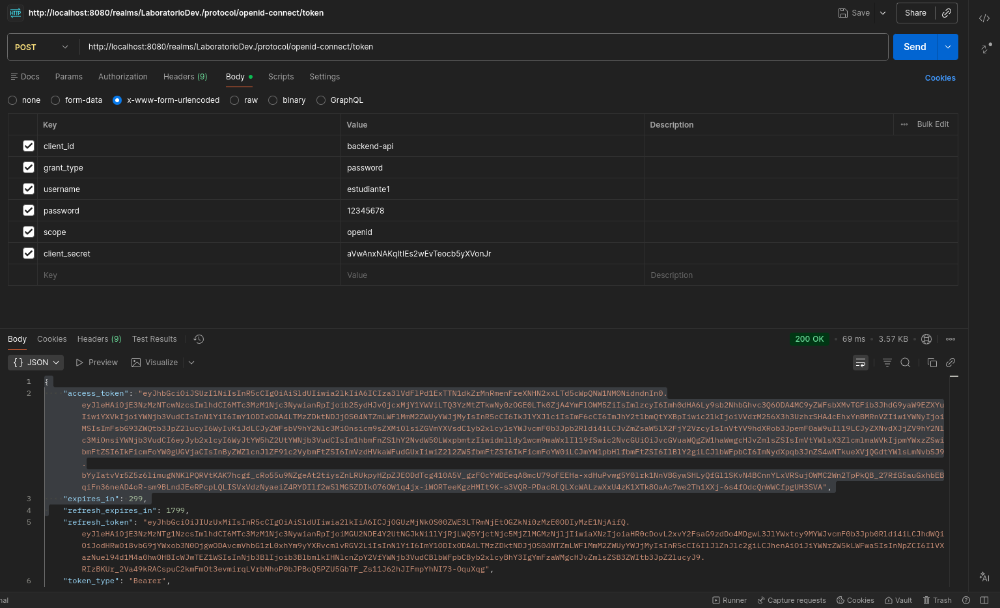
*   **Acceso Denegado (Sin Token):**
    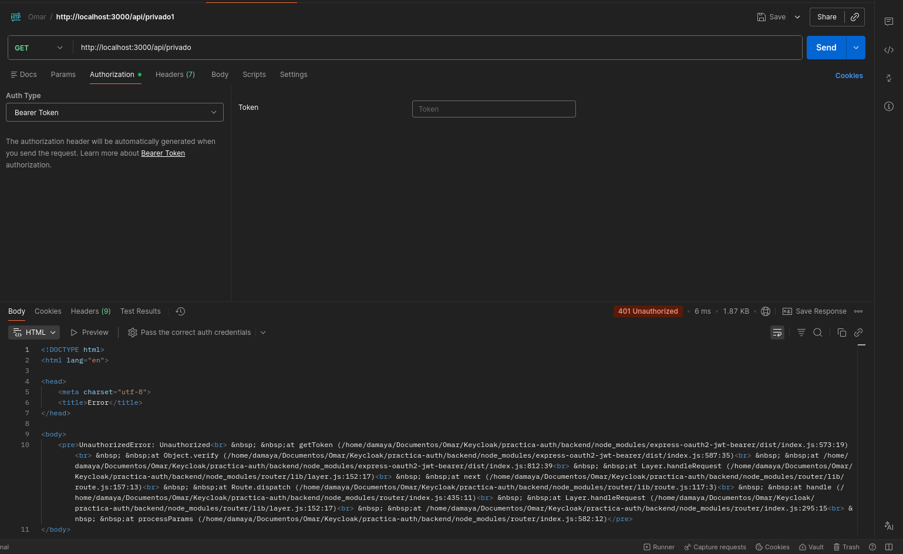
*   **Acceso Concedido (Con Token):**
    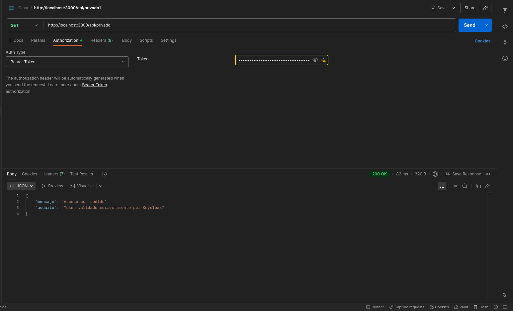

---
**Resultado:** Se logró implementar un flujo completo de autenticación segura, incluyendo gestión de identidad, MFA y protección de recursos en una API Node.js.
